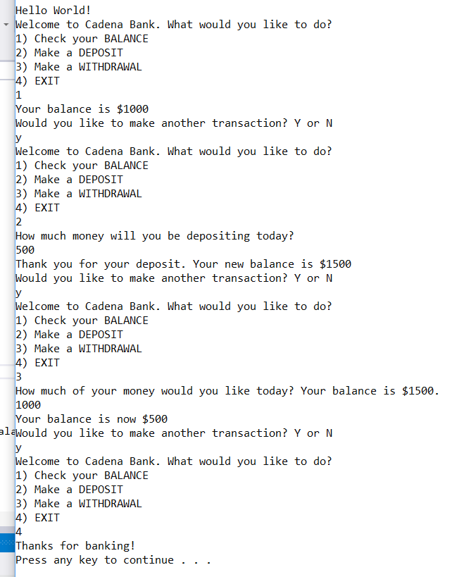

# Lab02-UnitTesting
This is a console application using C# that allows a user to have a premium banking experience right in their living room.

### To Run
# From the command line:
- git clone git@github.com:carloscadena/Lab02-UnitTesting.git
- cd Lab02-UnitTesting/Lab02-UnitTesting
- dotnet run

### Purpose
* Give a user a more pleasurable experience than they get at most banks.
* Test my ability to xUnit testing and build Console applications

### Visual Example

